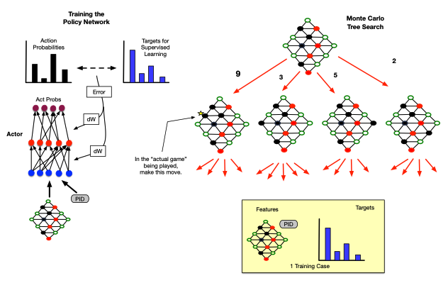
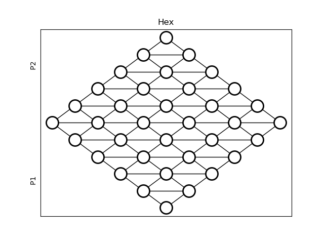

# Deep Reinforcement Learning and MCTS for solving HEX 🤖

This is a machine learning project that implements a Monte Carlo Tree Search (MCTS) system and combines it with Reinforcement Learning (RL) and Deep Learning (DL) to play the board game known as Hex. For a complete description of the game, see [Wikipedia]https://no.wikipedia.org/wiki/Hex. This game has simple rules but many possible game states which necessitates the use of function approximators such as neural nets for the value function and policy.

An on-policy MCTS is used to provide target probability distributions for training the policy network that fulfills the roles of both target and behavior policy. This algorithm contains of four separate processes known as tree search, node expansion, leaf evaluation and backpropagation. Each RL episode consists of many MCTS runs used to update the target policy which is then used to chose an actual move to perform in the board game. Each actual move in an episode is hence based on many search games, so the statistics accumulated over all MC searches provide the basis for an intelligent choice of a single actual move from the current state in the current episode. These statistics are given with the current state to train the neural network used by the MCTS algorithm. The diagram below illustrates the use of MCTS to produce target probabilities used to train the policy network. 

The figure below shows an example of a solution produced by the MCTS and RL system. 

